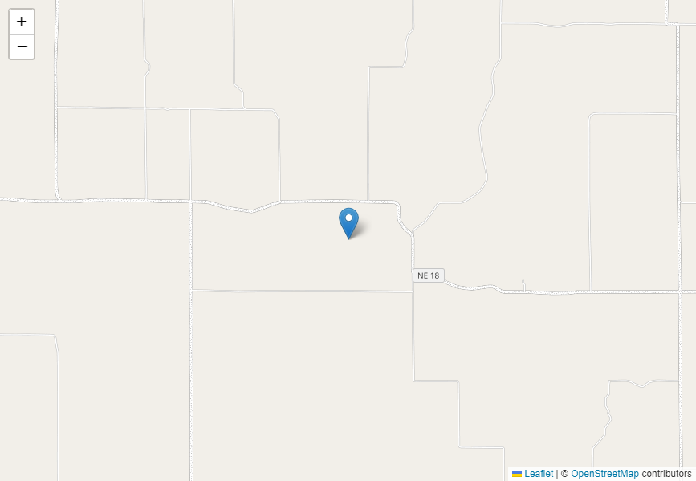

# Projeto Next Devices

Projeto consruído com atributos inovadores e tecnológicos, demonstração de um mapa moderno e atualizado, sendo possível inserção de pontos de interesse (POI).

## 🛠️ Tecnologias Utilizadas:
1 - React 
2 - TypeScript
3 - Vite
4 - HTML
5 - CSS
6 - NodeJs
7 - Git
8 - GitHub
9 - reset.scss

[ 🔗 Clique aqui para acessar a página no GitHub](https://github.com/luizctb/next-devices)

## Descrição do projeto:

Uma aplicação web que utiliza várias tecnologias como React, TypeScript, Vite, Reset.scss e fazendo integração com o Leaflet - Maps / OpenStreetMap. 

Projeto criado com tecnologia React + Vite (palavra francesa para "rápido", pronunciado/vit/, como "veet") fornece uma experiência de desenvolvimento mais rápida e enxuta para projetos web modernos.

Reset.scss utilizado como solução padrão e absoluta para remover interferência do browser/navegador na apresentação da página.

TypeScript é a linguagem de programação escolhida onde a base principal é o JavaScript e trás combinações modernas de interação do usuário com os conteúdos apresentados.

Leaflet - Maps foi escolhida por ser uma biblioteca JavaScript de código aberto, sendo possível elaboração de mapas interativos e personalizados e também por sua compatibilidade com browsers e com dispositivos móveis sem imperfeições e ou interferências.

Este código é um componente React que utiliza a biblioteca react-leaflet para criar um mapa interativo onde os usuários podem adicionar marcadores de pontos de interesse (POI) e remover esses marcadores.

# AQUI ESTÁ UMA EXPLICAÇÃO PASSO A PASSO DO CÓDIGO:

### 1 - Importações: 
Importa os módulos necessários do React e do react-leaflet para criar o mapa interativo.
### 2 - Ponto Inicial:
Define um ponto inicial com uma descrição e uma posição geográfica como latitude e longitude.
### 3 - Componente App:
Define o componente funcional principal App, que contém o estado listOfPOI para armazenar os pontos de interesse. ” listOfPOI é responsável por exibir os marcadores no mapa, e cada item nessa lista é um objeto que representa um ponto de interesse com descrição e posição geográfica.”
### 4 - MapEvents:
Criado um componente MapEvents que utiliza o hook useMapEvents para adicionar um evento de clique no mapa. Quando o mapa é clicado, um novo ponto de interesse é criado e adicionado à lista listOfPOI.
### 5 – Mapa:
Renderiza o MapContainer do react-leaflet com um mapa centrado na posição inicial e uma camada de azulejos OpenStreetMap.
Renderiza os marcadores para cada ponto de interesse na lista listOfPOI, exibindo uma descrição e um botão para remover o ponto de interesse.
### 6 – Alerta:
Exibe um alerta quando a janela é carregada, incentivando o usuário a marcar um ponto de interesse.

# AQUI ESTÁ UMA EXPLICAÇÃO PARA O USUÁRIO:

Ao abrir a página do Next Devices o usuário se depara de cara com um alerta “Marque seu ponto de Interesse” Após clicar em “OK” será direcionado para uma visualização de um mapa interativo. 

O usuário conta com uma aba à esquerda superior de + & - para aplicação do Zoom do mapa.

O mapa pode ser movimentado com de acordo com a posição escolhida pelo usuário. 

Ao clicar no mapa em qualquer ponto será adicionado o “Ponto de Interesse POI” que vai ser demarcado com um sinaleiro no local, cada clique é uma inserção de pontos.

